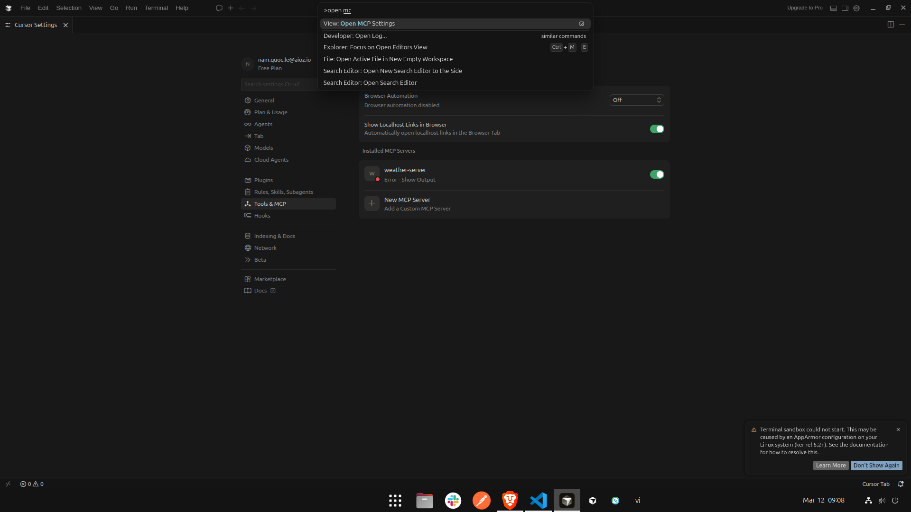
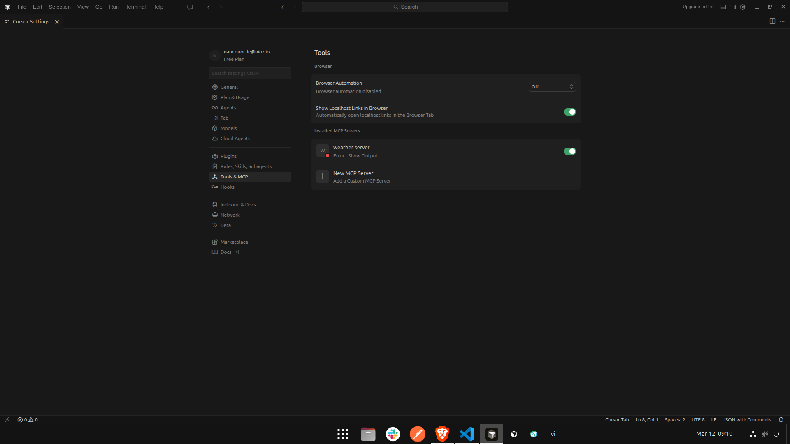
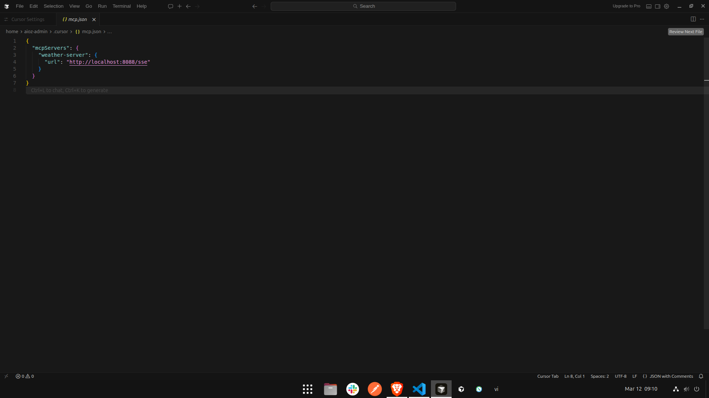
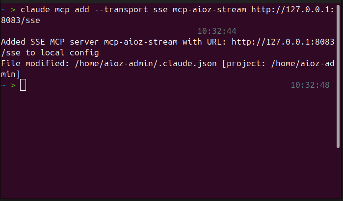
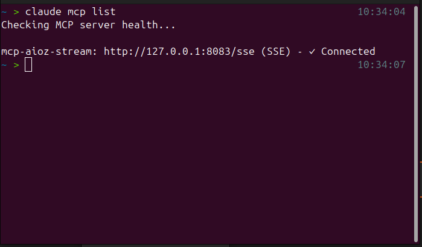
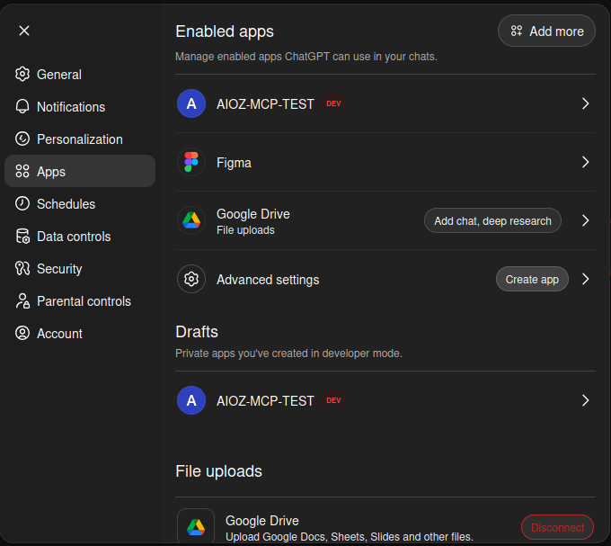
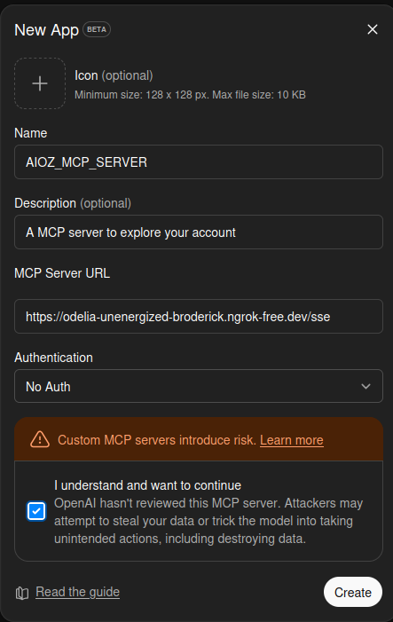
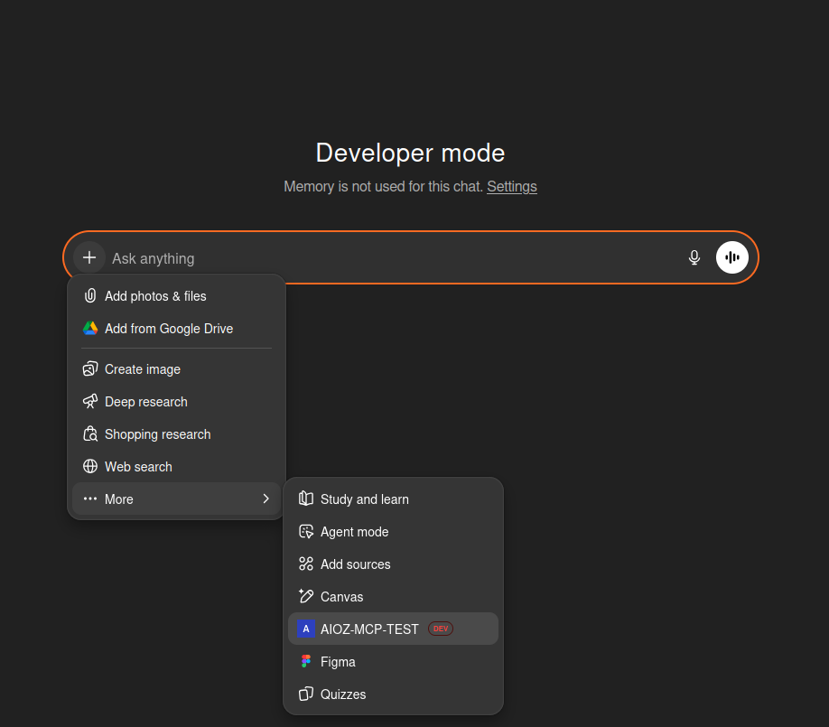
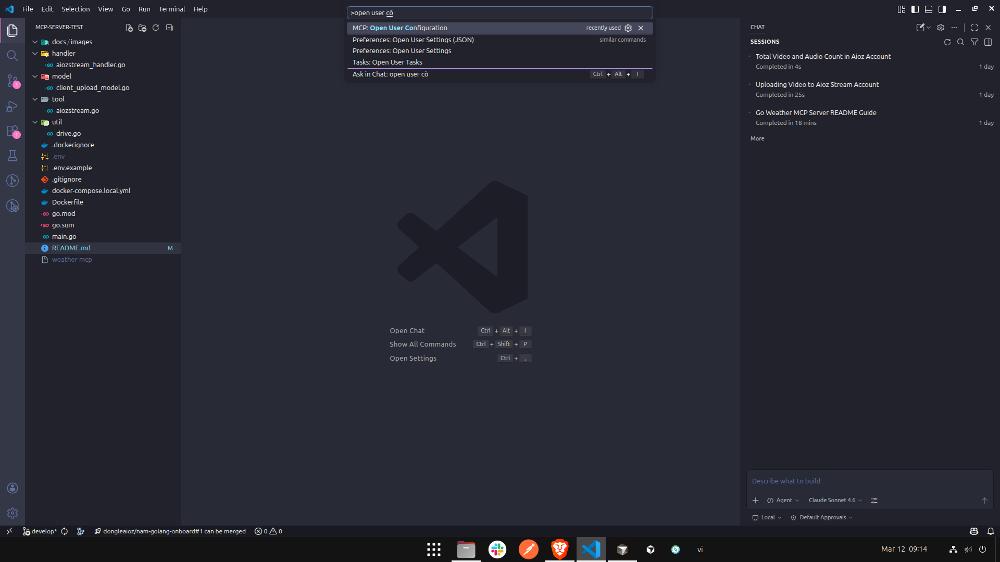
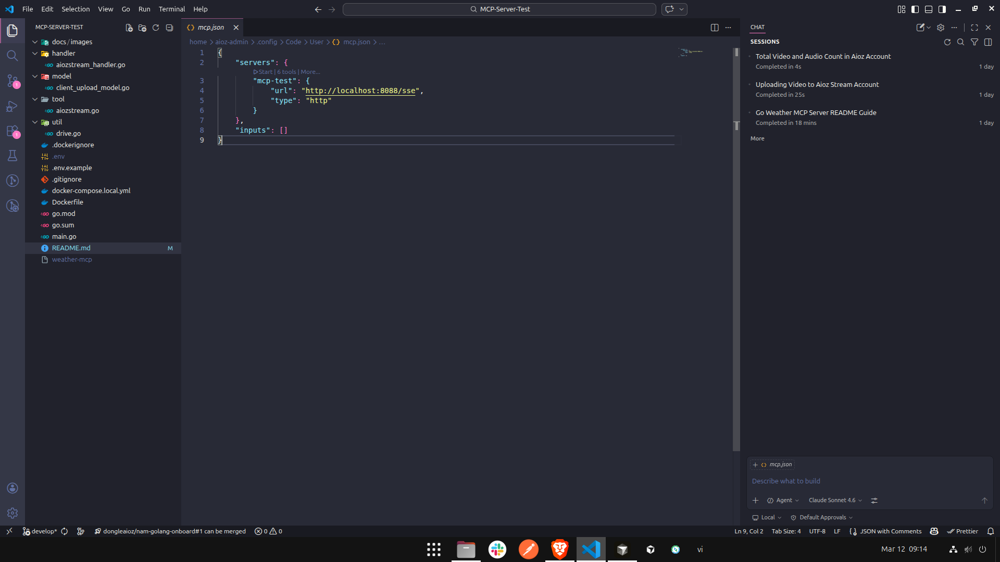

# AIOZ Pin MCP Server

A [Model Context Protocol (MCP)](https://modelcontextprotocol.io/) server written in Go that integrates with [AIOZ Pin](https://pin.aioz.io/) for decentralized file pinning to IPFS and API key management.

---

## Features

- **API Key Management**: Generate, list, and delete API keys with granular permissions.
- **IPFS Pinning**: Pin files and directories to IPFS by URL or CID hash.
- **Pin Management**: Retrieve pin details, list pins, and unpin content.
- **Usage Analytics**: Track historical usage, monthly data, and top-up information.

---

## MCP Tools

---

### API Key Management Tools

#### `generate-api-key`

Generate an AIOZ Pin API key with customizable permissions. Admin keys grant full access to all scopes, while regular keys require at least one specific permission.

| Parameter       | Type    | Required | Description                               |
| --------------- | ------- | -------- | ----------------------------------------- |
| `jwtToken`      | string  | Yes      | JWT token for authorization               |
| `keyName`       | string  | Yes      | Name of the API key                       |
| `admin`         | boolean | Yes      | If true, grants full access to all scopes |
| `pinList`       | boolean | Yes      | Allow listing pins                        |
| `nftList`       | boolean | Yes      | Allow listing NFTs                        |
| `unpin`         | boolean | Yes      | Allow unpinning content                   |
| `pinByHash`     | boolean | Yes      | Allow pinning by hash                     |
| `pinFileToIPFS` | boolean | Yes      | Allow uploading files to IPFS             |
| `unpinNFT`      | boolean | Yes      | Allow unpinning NFTs                      |
| `pinNFTToIPFS`  | boolean | Yes      | Allow uploading NFTs to IPFS              |

---

#### `get-list-api-keys`

Retrieve a list of all AIOZ Pin API keys.

| Parameter  | Type   | Required | Description                 |
| ---------- | ------ | -------- | --------------------------- |
| `jwtToken` | string | Yes      | JWT token for authorization |

---

#### `delete-api-key`

Delete an AIOZ Pin API key.

| Parameter  | Type   | Required | Description                 |
| ---------- | ------ | -------- | --------------------------- |
| `jwtToken` | string | Yes      | JWT token for authorization |
| `keyId`    | string | Yes      | ID of the API key to delete |

---

### Pinning Tools

#### `pin-files-or-directory`

Pin a file to IPFS using the provided pinning API key and secret key. The server downloads the file from a publicly accessible URL and uploads it to IPFS.

| Parameter          | Type   | Required | Description                  |
| ------------------ | ------ | -------- | ---------------------------- |
| `fileUrl`          | string | Yes      | Public downloadable file URL |
| `pinningApiKey`    | string | Yes      | AIOZ Pinning API key         |
| `pinningSecretKey` | string | Yes      | AIOZ Pinning secret key      |

---

#### `pin-by-cid`

Pin content to IPFS by CID hash using pinning API key and secret key.

| Parameter          | Type   | Required | Description                               |
| ------------------ | ------ | -------- | ----------------------------------------- |
| `hashToPin`        | string | Yes      | CID hash to pin                           |
| `metadataName`     | string | No       | Optional name metadata for pinned content |
| `pinningApiKey`    | string | Yes      | AIOZ Pinning API key                      |
| `pinningSecretKey` | string | Yes      | AIOZ Pinning secret key                   |

---

#### `get-pin-details`

Get pin details by pin ID.

| Parameter          | Type   | Required | Description             |
| ------------------ | ------ | -------- | ----------------------- |
| `pinId`            | string | Yes      | Pin ID to fetch details |
| `pinningApiKey`    | string | Yes      | AIOZ Pinning API key    |
| `pinningSecretKey` | string | Yes      | AIOZ Pinning secret key |

---

#### `list-pins`

List pins with pagination and sorting options.

| Parameter          | Type    | Required | Description                           |
| ------------------ | ------- | -------- | ------------------------------------- |
| `offset`           | number  | No       | Pagination offset, default 0          |
| `limit`            | number  | No       | Pagination limit, default 10          |
| `pinned`           | boolean | No       | Filter by pinned state, default true  |
| `sortBy`           | string  | No       | Sort field, default name              |
| `sortOrder`        | string  | No       | Sort order (ASC or DESC), default ASC |
| `pinningApiKey`    | string  | Yes      | AIOZ Pinning API key                  |
| `pinningSecretKey` | string  | Yes      | AIOZ Pinning secret key               |

---

#### `unpin-file`

Remove a pinned file by pin ID.

| Parameter          | Type   | Required | Description             |
| ------------------ | ------ | -------- | ----------------------- |
| `pinId`            | string | Yes      | Pin ID to remove        |
| `pinningApiKey`    | string | Yes      | AIOZ Pinning API key    |
| `pinningSecretKey` | string | Yes      | AIOZ Pinning secret key |

---

### Usage Tools

#### `get-history-usage-data`

Get history usage data details with pagination.

| Parameter          | Type   | Required | Description                  |
| ------------------ | ------ | -------- | ---------------------------- |
| `offset`           | string | Yes      | Pagination offset, default 0 |
| `limit`            | string | Yes      | Pagination limit, default 10 |
| `pinningApiKey`    | string | Yes      | AIOZ Pinning API key         |
| `pinningSecretKey` | string | Yes      | AIOZ Pinning secret key      |

---

#### `get-top-up`

Get top-up data details with pagination.

| Parameter          | Type   | Required | Description                  |
| ------------------ | ------ | -------- | ---------------------------- |
| `offset`           | string | Yes      | Pagination offset, default 0 |
| `limit`            | string | Yes      | Pagination limit, default 10 |
| `pinningApiKey`    | string | Yes      | AIOZ Pinning API key         |
| `pinningSecretKey` | string | Yes      | AIOZ Pinning secret key      |

---

#### `get-month-usage-data`

Get monthly usage data details with pagination.

| Parameter          | Type   | Required | Description                  |
| ------------------ | ------ | -------- | ---------------------------- |
| `offset`           | string | Yes      | Pagination offset, default 0 |
| `limit`            | string | Yes      | Pagination limit, default 10 |
| `pinningApiKey`    | string | Yes      | AIOZ Pinning API key         |
| `pinningSecretKey` | string | Yes      | AIOZ Pinning secret key      |

---

## HTTP Endpoints

### `GET /ping`

Health check endpoint.

**Response:** `pong`

---

## Installation

### Prerequisites

- [Go](https://go.dev/doc/install) 1.24.0 or later
- A valid [AIOZ Stream](https://stream.aioz.io/) account with API credentials

### Build

```bash
git clone <repository-url>
cd MCP-Server-Test
go build -o aioz-mcp-server .
```

### Environment Variables

Create a `.env` file in the project root (optional):

```env
SERVER_PORT=8087
```

If `SERVER_PORT` is not set, the server defaults to port `8087`.

---

## Running the Server

```bash
go run .
```

Or using the compiled binary:

```bash
./aioz-mcp-server
```

The server will start on `http://localhost:8087` by default. MCP clients connect via SSE at `http://localhost:8087/`.

---

## Configuration

---

### Cursor

Cursor is a code editor with native MCP support. Follow these steps:

**Step 1 — Open the MCP config file**

- Press `Ctrl + Shift + P` (Windows/Linux) or `Cmd + Shift + P` (macOS)
- Type **"Open MCP Settings"** → press Enter
- The `mcp.json` file will open (usually located at `~/.cursor/mcp.json`)

**Step 2 — Add the server to the config**

Paste the following into the file (if the file already has content, just add the `aioz-mcp-server` entry inside `mcpServers`):

```json
{
  "mcpServers": {
    "aioz-mcp-server": {
      "url": "http://localhost:8087/sse"
    }
  }
}
```

**Step 3 — Save and verify**

- Save the file (`Ctrl + S`)
- Open **Cursor Chat** (`Ctrl + L`) and try: _"Count the total number of videos in my AIOZ Stream account"_
- Cursor will automatically call the `count-total-media` tool

| Step 1                                          | Step 2                                          | Step 3                                          |
| ----------------------------------------------- | ----------------------------------------------- | ----------------------------------------------- |
|  |  |  |

---

### Claude CLI

Claude CLI supports MCP through its own config file.

**Step 1 — Open the Claude CLI**

- Launch the Claude CLI from your terminal.

**Step 2 — Set up the MCP server**

- Use the following command to add your MCP server:
  `claude mcp add --transport sse <server-name> <server-url>`

  Parameters:
  - <server-name>: The name you want to assign to your MCP server (e.g., mcp-aioz-stream)
  - <server-url>: The endpoint URL of your MCP server (e.g., http://localhost:8087/sse)

  Example: claude mcp add --transport sse mcp-aioz-stream http://localhost:8087/sse

**Step 3 — Check your MCP server**

- Use the following command to list tool in your MCP server:
  `claude mcp list`

| Step 1                                              | Step 2                                              |
| --------------------------------------------------- | --------------------------------------------------- |
|  |  |

---

### ChatGPT

**Step 1 — Enable developer mode**

Make sure developer mode is enabled in your ChatGPT account settings before proceeding.

**Step 2 — Create a connector**

- In ChatGPT, navigate to **Settings → Apps → Advanced settings -> Create App**
- Fill in the connector metadata:
  - **Name** — a user-facing title such as `AIOZ MCP Server`
  - **Description** — explain what the connector does and when to use it. The model uses this text during discovery
  - **MCP Server URL** — the `/sse` endpoint of your server: `http://localhost:8087/sse`
  - **Authentication** — choose `No auth`
  - **Risk and policy** — checked box `I understand and want to continue`

**Step 3 — Verify**

- Click **Create**
- If the connection succeeds, ChatGPT will display a list of tools your server advertises
- If it fails, debug your app with [MCP Inspector](https://modelcontextprotocol.io/docs/tools/inspector) or the API Playground

**Step 4 — Use MCP server**

- Create a new chat
- Click the `+` button on the left side of the input box
- Select More, then choose your MCP server
- Enter a prompt to test a tool

| Step 1                                            | Step 2                                            | Step 3                                            |
| ------------------------------------------------- | ------------------------------------------------- | ------------------------------------------------- |
|  |  |  |

---

---

### Visual Studio Code (VS Code)

VS Code supports MCP through **GitHub Copilot** (Agent mode must be enabled).

**Step 1 — Open the config file**

- Press `Ctrl + Shift + P` → type `Open User Configuration` → `.vscode/mcp.json`

**Step 2 — Add the MCP config**

```json
{
  "servers": {
    "aioz-mcp-server": {
      "type": "sse",
      "url": "http://localhost:8087/sse"
    }
  }
}
```

**Step 3 — Enable Agent Mode in Copilot Chat**

- Open **Copilot Chat** (`Ctrl + Alt + I`)
- At the top of the chat, switch to **Agent** mode (instead of Ask/Edit)
- Try: _"List all videos in my AIOZ Stream account"_

| Step 1                                          | Step 2                                          |
| ----------------------------------------------- | ----------------------------------------------- |
|  |  |

---

## Docker

A `Dockerfile` and `docker-compose.local.yml` are provided for containerized deployment.

```bash
docker compose -f docker-compose.local.yml up --build
```

---

## Project Structure

```
.
├── main.go                               # Entry point, MCP server and tool registration
├── handler/
│   ├── register_handler.go               # Main tool registration
│   ├── register_api_key_tools.go         # API key management tool handlers and registration
│   ├── register_pinning_tools.go         # IPFS pinning tool handlers and registration
│   ├── register_usage_tools.go           # Usage analytics tool handlers and registration
│   ├── aiozstream_handler.go             # AIOZ Stream tool handlers (legacy)
├── middleware/
│   └── auth_middleware.go                # JWT authentication middleware
├── model/
│   ├── auth_model.go                     # Authentication models
│   ├── billing_model.go                  # Billing models
│   ├── generate_key_model.go             # API key generation models
│   ├── pin_files_model.go                # Pin file models
│   ├── pinning_model.go                  # Pinning models
├── tool/
│   └── aiozstream.go                     # AIOZ API client logic
├── pkg/
│   └── cache/
│         └── init_cache.go               # Cache initialization
├── util/
│   └── make_request.go                   # HTTP request utilities
├── go.mod
├── Dockerfile
└── docker-compose.local.yml
```
